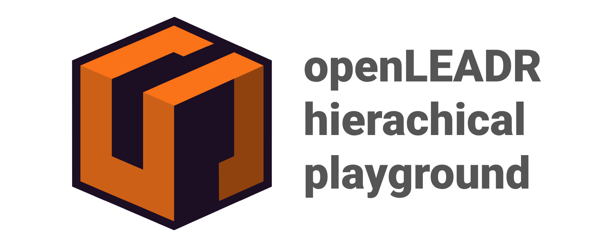
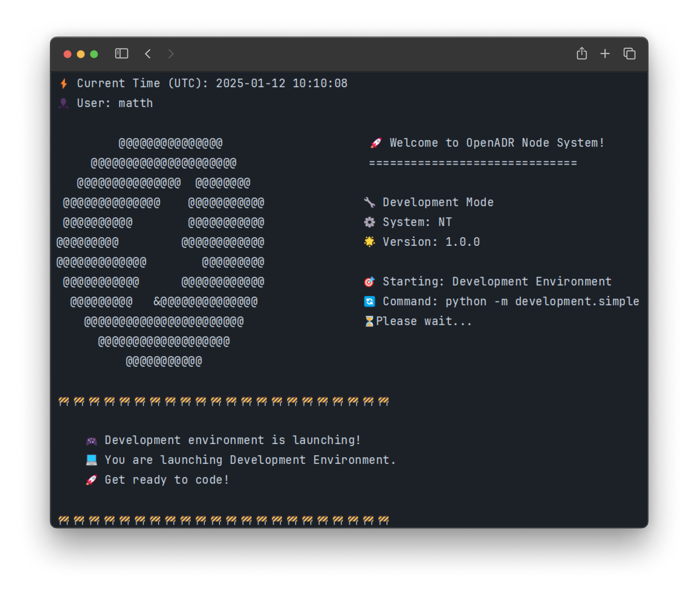
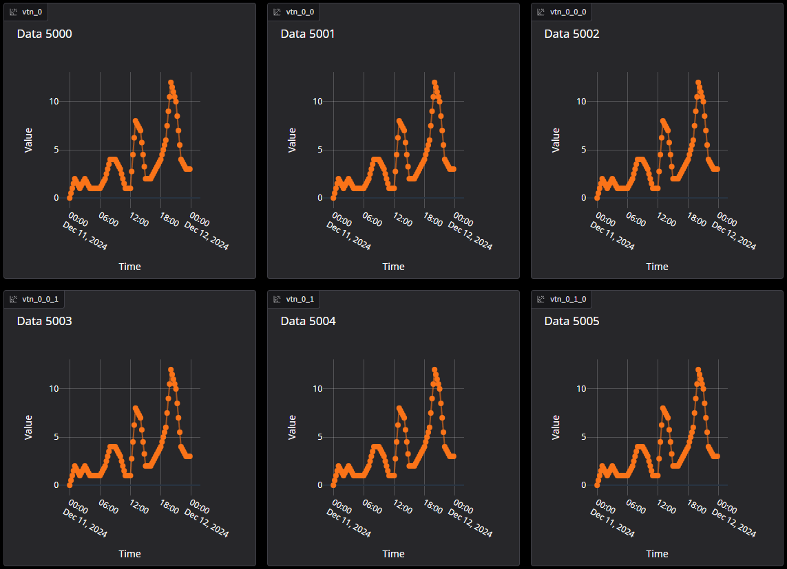

# 🌟 Basic Idea

This repository provides an implementation of a hierarchical network infrastructure utilizing the OpenADR protocol.
It offers a systematic approach to fair load distribution and integrates Loxone into the overall application.
The hierarchical structure ensures efficient communication and control across different nodes, facilitating robust and scalable energy management solutions.

## 🚀 Installation Guide

This guide will help you set up and run the server, client, and node using Scoop and Pipenv.

## ✨ Prerequisites

💡 Suggestion: Make sure some kind of package manager is installed on your system (e.g., Scoop for Windows, Homebrew for macOS, or Pacman for Linux). This makes it easier to install and maintain different Python versions.
This guide will specifically cover the installation of Python 3.12 using [Scoop](https://scoop.sh/) on Windows.

## 🛠️ Setup Instructions

### 🔧 Basic Setup (Windows)

1. **Add the `versions` bucket to Scoop:**

    ```bash
    scoop bucket add versions
    ```

2. **Install Python 3.12 using Scoop:**

    ```bash
    scoop install versions/python312
    ```

3. **Install Pipenv:**

    ```bash
    pip install pipenv
    ```

### 📦 Project Installation

1. **Navigate to the project directory:**

    ```bash
    cd ./openleadr-playground
    ```

2. **Install project dependencies using Pipenv:**

    ```bash
    pipenv install
    ```

3. **Activate the Pipenv shell:**

    ```bash
    pipenv shell
    ```

### 🔌 Start nodes

The basic implementation of the OpenADR node provides a simple base node that can be easily extended.
The house, middle, and mock nodes are examples of such extensions.
Which will be used to demonstrate the hierarchical network infrastructure.

1. **Start the house node:** 🏠

    ```bash
    pipenv run start-house-node
    ```

2. **Start the mock node:** 🤖

    ```bash
    pipenv run start-mock-node
    ```

An environment has been set up for local development,
allowing you to run both the house and the mock node simultaneously.
This environment also allows you to use the corresponding gradio UIs.

1. **Start the development environment** 🚀
    ```bash
    pipenv run start-mock-node
    ```

### 💻 Development Environment

#### 🚀 Quick Start
To facilitate local development and testing without repeated Docker deployments, we've created a streamlined development environment. This environment includes:
- 🌳 Root node
- 🏠 Two house nodes
- 📊 Node dashboard
- 🔄 Auto-loading services

1. **Launch Development Mode** ⚡
    ```bash
    pipenv run dev
    ```


#### 🔐 Environment Configuration

##### Core Environment (.env)
All core environment variables are automatically loaded from the `.env` file when running the `dev` command.

##### MQTT Configuration (.env.mqtt)
For MQTT service integration, create an `.env.mqtt` file with these variables:

```env
# WARNING: Never commit this file with real credentials!
PRIVATE_MQTT_BROKER_URL=your_broker_url
PRIVATE_MQTT_USERNAME=your_username
PRIVATE_MQTT_PASSWORD=your_password
PRIVATE_MQTT_PORT=your_port
PRIVATE_MQTT_TOPIC_LOAD_PROFILE=your_load_profile_topic
PRIVATE_MQTT_TOPIC_LOAD_CONSUMPTION=your_consumption_topic
```

📁 **File Locations:**
- **Production:** Create `.env.mqtt` in the project root directory
- **Development:** Create `.env.mqtt` in `development/simple` directory

✨ **Features:**
- 🔄 Automatic service initialization - Services start automatically without manual configuration
- 📊 Integrated node dashboard - Real-time monitoring of node status and performance
- 🔌 Pre-configured network setup - Ready-to-use network topology for testing
- 🚀 One-command launch system - Simple `dev` command starts all components

> 💡 **Note:** All services, including the node dashboard, start automatically with the `dev` command. No additional configuration is needed for basic development setup.
## 🐳 Containerized approach

This repository allows you to create hierarchical containers,
where each node has 2 children (done for simplicity), this is only for testing purposes and
to demonstrate the capabilities of the implementation.
Note: The installation steps have to be followed before running the docker compose file.

1. **Create the docker compose file:** 📝

    ```bash
    pipenv run generate-docker-compose -l <layers> -c <children>
    ```

    - `-l` or `--layers`: Specifies the number of layers to generate.
    - `-c` or `--children`: Specifies the number of children in the last layer.

2. **Start the containers:** 🚀

    ```bash
   docker compose up
    ```

3. **Stop the containers:** 🛑

    ```
    docker compose down
    ```

### 📊 Additional dashboard

This application also provides a dashboard to visualize and periodically update the load profile of the nodes.
It uses the additional generated file `env_variables` to fetch the data from the endpoints.


